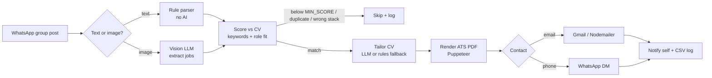

# Job Auto-Apply


A WhatsApp bot that watches job-opening groups, scores every post against your CV, builds a tailored ATS-friendly CV for the good matches and applies by email or WhatsApp. It runs unattended on a home PC.

## Highlights

- **AI only where it pays off.** Text posts are parsed with rules, using no tokens. A vision LLM is called only for image posters and for tailoring CVs that will actually be sent.
- **Multi-provider LLM fallback.** A configurable `provider:model` chain (Groq → Gemini) with retries and daily-quota detection, so free-tier limits never stop the bot.
- **ATS-style scoring.** 70% skill-keyword coverage plus 30% role fit, with skill synonyms (e.g. `nodejs` = `Node.js`, `restful` = `REST API`), checks on stack mismatch and years of experience, and de-duplication against past applications.
- **Honest tailoring.** Bullets are reordered and filtered, never invented. CV content stays word-for-word from the master CV, and a sanitizer drops any skill, number or seniority claim the model adds.
- **Self-healing.** Watchdogs re-scan groups, restart after PC sleep or a lost connection, and recover when WhatsApp Web stalls. A daily cap and random delays keep activity human-paced.
- **Dry-run first.** `DRY_RUN=true` runs the whole pipeline, including the PDF, without sending anything.

## How it works



| Module | Responsibility |
|---|---|
| [`src/index.js`](src/index.js) | WhatsApp client, group backfill, watchdogs, graceful shutdown |
| [`src/pipeline.js`](src/pipeline.js) | Orchestrates one post end to end |
| [`src/parse.js`](src/parse.js) / [`src/extract.js`](src/extract.js) | Rule-based parsing / LLM extraction for posters |
| [`src/ats.js`](src/ats.js) / [`src/match.js`](src/match.js) | Keyword coverage, role fit, experience rules |
| [`src/ai.js`](src/ai.js) | Provider-agnostic JSON LLM client with fallback chain |
| [`src/tailor.js`](src/tailor.js) / [`src/tailor-rules.js`](src/tailor-rules.js) | LLM tailoring with sanitizing, plus a rules-only fallback |
| [`src/pdf.js`](src/pdf.js) | HTML → single-column ATS PDF |
| [`src/mailer.js`](src/mailer.js) / [`src/store.js`](src/store.js) | Gmail sending, application history and daily caps |

## Setup

Requires Node.js 20+ on Windows, macOS or Linux.

```bash
npm install
cp .env.example .env                               # then fill it in
cp cv/master-cv.example.json cv/master-cv.json     # then put your real CV in it
```

| Key | What |
|---|---|
| `GROQ_API_KEY` | Free key from https://console.groq.com/keys (primary AI) |
| `GEMINI_API_KEY` | Free key from https://aistudio.google.com/apikey (backup AI) |
| `WHATSAPP_GROUPS` | Exact group name(s), comma-separated |
| `GMAIL_USER` / `GMAIL_APP_PASSWORD` | Gmail address + [App Password](https://myaccount.google.com/apppasswords) |
| `DRY_RUN` | `true` = do everything except send. Start with this. |
| `MIN_SCORE`, `MAX_APPLICATIONS_PER_DAY` | Match threshold (default 70) and daily cap (default 12) |

## Run

```bash
npm run try -- sample-job.txt   # test one post, no WhatsApp needed
npm start                       # scan the QR once (WhatsApp > Linked devices)
```

On Windows, `scripts/run-bot.cmd` starts the bot and restarts it if it exits. To run it at login, put a shortcut to it in `shell:startup`.

## Notes

- `patches/` holds fixes for whatsapp-web.js 1.34.7, which broke after the July 2026 WhatsApp Web update. They are applied automatically after `npm install`.
- WhatsApp does not allow bots on personal accounts. Use at your own risk.
- `cv/master-cv.json`, `.env`, `data/` and `out/` are git-ignored because they contain personal data.

## License

[MIT](LICENSE)
